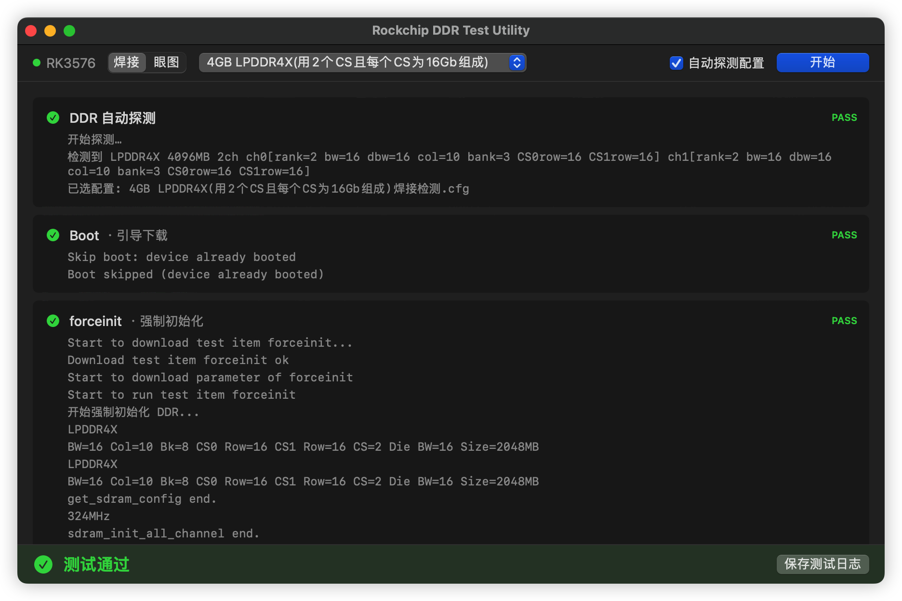
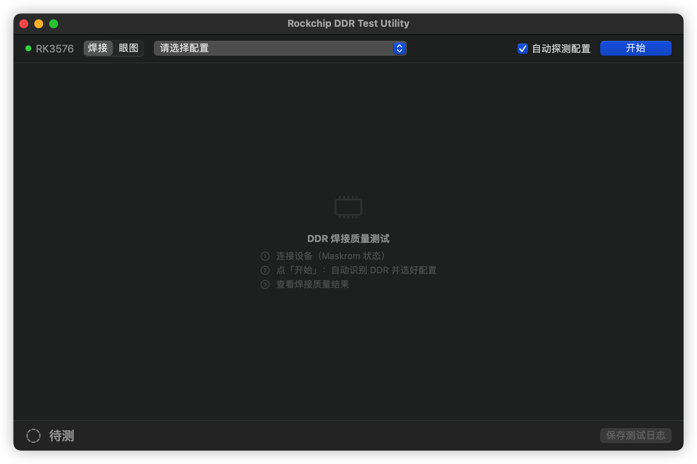
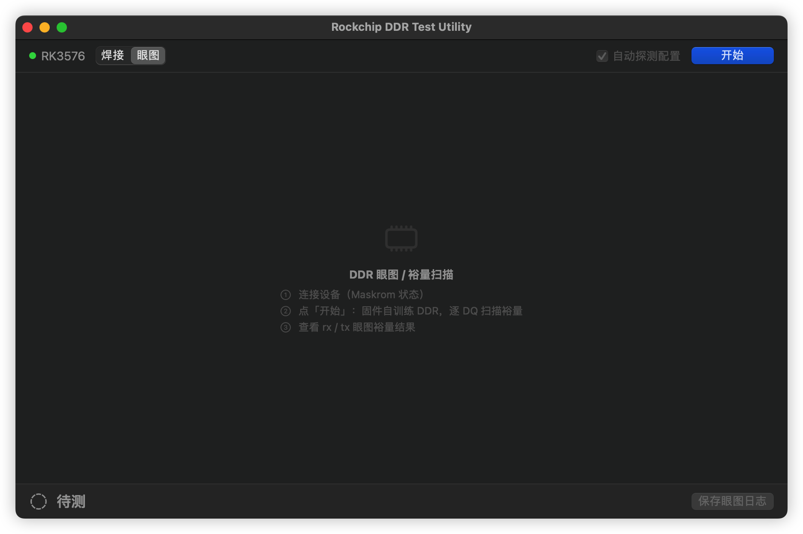
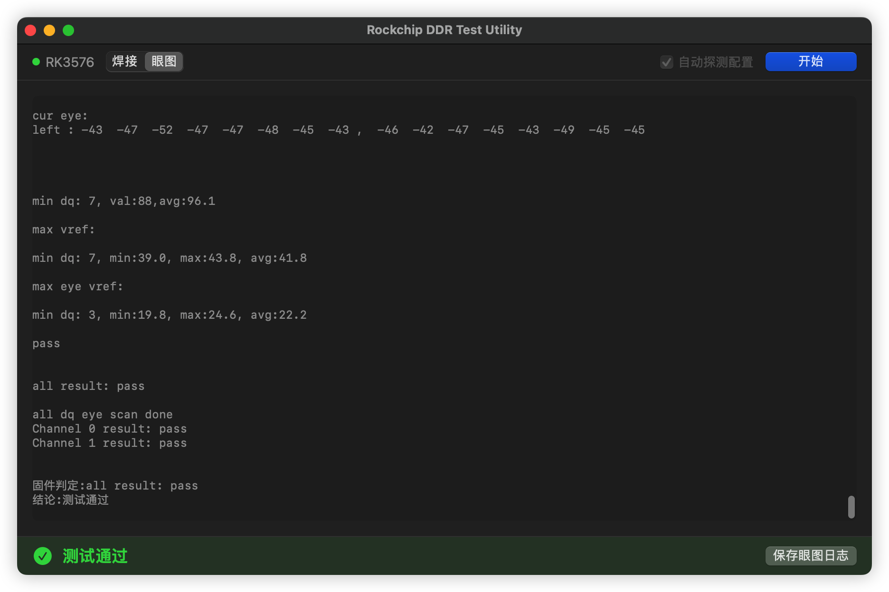

# Rockchip DDR Test Utility for macOS

A macOS native tool for testing DDR memory on Rockchip SoCs **over pure USB** — no serial/UART, no flashing, nothing written to the board's storage. The device stays in Maskrom the whole time.



*焊接检测 after a pass: auto-detect filled in the config, each stage carries the device's own output, and the verdict has its own row.*

## What it does

Three checks, all driven from the same USB session:

| Check | GUI | CLI | Verdict |
|-------|-----|-----|---------|
| **DDR 自动探测** — probe the DRAM geometry (type / capacity / channels / per-channel rank, col, bank, row, bus width, die width) and match it to a test config | runs as the first step of 焊接 | `--detect` | a unique cfg match (`uniqueByCoarse` / `uniqueByTieBreak`) |
| **焊接检测** — the soldering-quality test (DQS / DQ / DM / CA / CS / ZQ checks) | 焊接 mode | `--solder` | device result code == 0 |
| **DQ 眼图** — per-DQ eye / margin scan (rx + tx) | 眼图 mode | `--eyescan` | scan completed **and** every `all result:` line passes |

Detection feeds the soldering test: it preselects the exactly-matching config, then the test runs on the same USB session with the already-resident loader (no reboot in between).

## Supported SoCs

Every SoC below ships soldering-test configs. The extra columns mark the SoCs that additionally support DDR auto-detect and eye-scan.

| SoC | USB PID | 焊接 | 自动探测 | 眼图 |
|-----|---------|:----:|:-------:|:----:|
| RK3588 | 0x350B | ✅ | ✅ | ✅ |
| RK3576 | 0x350E | ✅ | ✅ | ✅ |
| RK3568 / RK3566 | 0x350A | ✅ | ✅ | ✅ |
| RK3288 | 0x320A | ✅ | ✅ | — |
| RK3562 | 0x350C | ✅ | — | — |
| RK3399 | 0x330C | ✅ | — | — |
| RK3368 | 0x330A | ✅ | — | — |
| RK3326 / PX30 / RK3326S / PX30S | 0x330D | ✅ | — | — |
| RK3328 / rk322xh | 0x320C | ✅ | — | — |
| RK322X | 0x320B | ✅ | — | — |
| RK3308 | 0x3308 | ✅ | — | — |
| RK3188 | 0x310B | ✅ | — | — |
| RK3168 | 0x300B | ✅ | — | — |
| RK3128 | 0x310C | ✅ | — | — |
| RK3126 / RK3126C | 0x310D | ✅ | — | — |
| RK3066 / RK3066A | 0x300A | ✅ | — | — |
| RK3036 | 0x301A | ✅ | — | — |
| RK3026 / RK3028A | 0x292C | ✅ | — | — |
| RK2926 / RK2928 | 0x292A | ✅ | — | — |
| RK29 | 0x290A | ✅ | — | — |
| RV1126 | 0x110C | ✅ | — | — |

Without auto-detect the config must be picked by hand from the toolbar pop-up; the test itself works the same.

`DDRTestFiles/` also carries configs for **RK3028, RK3528, RV1126B, RV1126BP**, which currently have no maskrom-PID mapping — a connected board of those SoCs is listed but its SoC can't be identified automatically. **RK3506** (0x350F) is recognized but ships no configs.

## Requirements

- macOS 12.0 (Monterey) or later
- Apple Silicon (arm64) or Intel (x86_64)
- Rockchip device connected in USB download mode (VID 0x2207, Maskrom)

Nothing to install: both downloads are universal binaries with libusb linked in. Homebrew is only needed to BUILD from source.

## Download

From [Releases](../../releases):

- **`RockchipDDRTestUtility.dmg`** — the GUI app. Open it, drag **Rockchip DDR Test Utility.app** to **Applications**, launch. Test configs are bundled inside the app.
- **`RockchipDDRTestUtilityCLI-macos.tar.gz`** — standalone CLI: **one universal executable**, nothing beside it. libusb is linked statically and the whole config library is compiled in, so it runs from anywhere with no Homebrew install and no `DDRTestFiles/` next to it.

## Usage (GUI)

1. Connect a Rockchip device via USB in Maskrom / download mode
2. Pick a mode: **焊接** (soldering test) or **眼图** (eye-scan). 眼图 is greyed out on SoCs that ship no eye-scan config.
3. Click **开始**
   - 焊接: auto-detect probes the DRAM, fills in the exactly-matching config, and the test runs straight after it
   - 眼图: the firmware self-trains the DDR and scans every DQ — no config involved, so the config pop-up disappears
4. Watch the log area — detection appears as the first card, followed by the test steps
5. Click **保存测试日志** / **保存眼图日志** to export

| 焊接 | 眼图 |
|:---:|:---:|
|  |  |
| config pop-up in the toolbar | no config — the geometry is probed |

Everything the run needs sits in the toolbar: which board, which check, which config. The verdict has a row of its own at the bottom of the window, so it never covers the log it is summarising.

- **Board** — with more than one board on the bus, a picker appears, labelling each by the socket it sits in (`RK3566 · 1.4`). Every path honours the choice, and switching boards drops the previous board's session (the next run boots and detects again). One board: just its chip name.
- **Config** — a pop-up beside the mode switch. With **自动探测配置** on it is filled in for you; with it off, pick one by hand.
- **自动探测配置** (on by default) — gates whether **开始** probes the DRAM at all. Turn it off to run a hand-picked config.

Plugging a board in never starts anything: every run begins at **开始**.

### Three verdicts, not two

The GUI's verdict row and the CLI's exit code report the same three states, and so
does the saved log file:

| | GUI | CLI | Saved file | What it means |
|---|---|---|---|---|
| pass | green **测试通过** | `0` | `Result: PASS` | the check passed |
| device verdict | red **测试失败** | `2` | `Result: FAIL` | the device tested the DDR and reported it bad — scrap the board |
| no verdict | orange **未测出结论** | `1` | `Result: NO VERDICT (<reason>)` | a USB stall, a missing config, a wedged eye-scan — the board was never judged, so fix the setup and re-run |

A cable pulled mid-test is not a bad board. Reporting it as one scraps good hardware, so nothing but the device's own result code can produce the middle row.

## Usage (CLI)

```bash
RockchipDDRTestUtilityCLI --list                  # list connected Rockchip devices
RockchipDDRTestUtilityCLI --detect                # DDR 自动探测 (geometry + cfg match)
RockchipDDRTestUtilityCLI --solder                # 焊接检测 (detect → test → reboot)
RockchipDDRTestUtilityCLI --eyescan               # DQ 眼图
RockchipDDRTestUtilityCLI --help
```

Options: `--device-id <id>` (pick one of several boards), `--detect-cfg <path>` (override the detect cfg), `--eye-timeout <seconds>`, `--json`, `--quiet`.

Those four commands are all of them — the diagnostic modes that existed while the USB layer was being brought up (`--cfg`, `--repeat`, `--probe-bulk`) are gone, so every command is inside the JSON contract below.

### Machine-readable output

`--json` emits exactly one JSON object on stdout; every human-facing log line goes to stderr. The device's own output is embedded, so the JSON is self-contained — no side files to collect and no printf scraping. It covers every command (`--detect`, `--solder`, `--eyescan`, `--list`) and every error path — there is no mode outside it, so `--json` always prints exactly one object.

```bash
RockchipDDRTestUtilityCLI --solder --json
```

```jsonc
{
  "mode": "solder",
  "pass": true,             // the one verdict field, in every mode
  "errorCode": null,        // absent unless there was NO verdict; see exit codes
  "errorMessage": null,
  "elapsedMs": 12345,
  "soc": "RK3568&RK3566", "pid": "0x350A", "device": "…",
  "cpuid": "4d344e…", "serial": "587dc6a514453616", "chipVariant": "RK3566",
  "rebootedToMaskrom": true,
  "detect":  { "pass": true, "tier": "uniqueByCoarse",
               "type": "LPDDR4", "capacityMB": 4096, "channels": 1, "csPerDie": 2,
               "sysRegVersion": 3, "geometry": [ /* per-channel rank/col/bank/row/bus/die */ ],
               "cfg": "…焊接检测.cfg", "candidates": ["…焊接检测.cfg"],
               "rawOsReg": ["0x00000000", "…"] },
  "solder":  { "pass": true, "cfg": "…", "bootSucceeded": true,
               "log": "…device USB printf + host errors…" }
}
```

`--eyescan` fills `eyescan: { pass, completed, wedged, bytes, transcript }` instead; `--list` fills `devices: [ { deviceID, vid, pid, name, soc } ]`. Keys whose value is null are omitted entirely.

### Exit codes

**0** and **2** both mean the device produced a verdict; **1** means it did not, so the board is untested rather than bad.

| Code | Meaning | Act on it by |
|------|---------|--------------|
| `0` | PASS — the check passed | ship the board |
| `2` | FAIL — the device tested the DDR and reported it bad | scrap the board |
| `1` | ERROR — no verdict at all | fix the setup and re-run; leave the board alone |

Only boards in **Maskrom** are candidates — the DDR bin is downloaded into SRAM over control transfer `0x0C/0x0471`, which no other USB personality accepts. A board in Loader or ADB mode is not listed and reports `noDevice`, matching `upgrade_tool ld` (which prints `connected(0)` for an ADB device). Admission is `idVendor == 0x2207 && idProduct >= 0x0100 && (bcdUSB & 1) == 0`, transcribed from `upgrade_tool`.

Exit `1` always carries an `errorCode`, one of: `badArgument` · `noDevice` · `cfgNotFound` · `unsupportedSoc` · `transport` · `probeFailed` · `ambiguousCfg` (geometry decoded, but more than one cfg matches — pick one manually) · `deviceWedged` (eye-scan: the board stopped responding, replug it) · `scanIncomplete` (eye-scan: still streaming at the deadline, raise `--eye-timeout`).

The distinction is what makes `2` trustworthy: a USB stall mid-test, a missing cfg, or an eye-scan timeout can no longer scrap a good board. `--detect` failing to match any cfg *is* a `2` — the cfg library covers every shipped DRAM combination, so a zero-match means the geometry read back doesn't correspond to a real part.

## Build from Source

```bash
brew install libusb
swift build -c release
```

```bash
swift run RockchipDDRTestUtility                     # GUI (development)
swift run RockchipDDRTestUtilityCLI --list           # CLI
swift test                                           # tests (no USB hardware needed)
bash scripts/package.sh                              # universal DMG + standalone CLI tarball
```

`package.sh` builds a universal **static** libusb (from source, one slice per arch,
`lipo`-merged) and links it into both executables, which is what makes the shipped
CLI a single file and leaves the app bundle with no `Frameworks/` and no rpath. It
fails the build if any shipped binary still references libusb dynamically —
such a binary would die on a machine without Homebrew.

Homebrew's libusb is still needed to build: `swift build` uses its headers.

## Test File Structure

Configs live in `DDRTestFiles/`, one subdirectory per SoC:

```
DDRTestFiles/
  RK3588/
    4GB LPDDR4.cfg
    8GB LPDDR4X.cfg
    DDR自动探测.cfg        # detect payload — driven by the detector, not user-selectable
    DDR眼图.cfg            # eye-scan payload — same
  RK3568&RK3566/
    2GB DDR4.cfg
  ...
```

`CfgRepository` resolves the root in this order:

1. App bundle: `Contents/Resources/DDRTestFiles/` (DMG install)
2. Executable directory: `DDRTestFiles/` next to the binary (CLI / development)
3. Current working directory: `./DDRTestFiles/`
4. Compiled-in fallback: the CLI embeds the whole library, extracted on demand — this is what makes the standalone CLI a single file. A real on-disk directory always wins.

## DDR Auto-Detect

The tool identifies a board's DRAM geometry over pure USB:

1. Downloads Rockchip's auto-probing DDR init blob → the SoC detects the DRAM and writes its geometry to the PMU `OS_REG` (SYS_REG) words
2. Loads the DDR Test Tool loader plus a small probe that dumps `OS_REG` back over USB
3. Decodes it — SYS_REG **V3** (RK356x / RK3576 / RK3588) or **V1** (RK3288)
4. Matches **exactly** on DRAM type + total capacity + per-die CS against that SoC's soldering configs; if several configs share a name, a second pass narrows them by each candidate's `forceinit` parameter geometry

A config is set only on a unique match. Anything else (ambiguous / no match) stops and asks for manual selection — it never silently runs a wrong config. The whole detect payload ships as one self-contained `DDR自动探测.cfg` per SoC, excluded from the selectable test list and driven by a dedicated detector rather than the test engine.

## Chip Identity & Variant

`--detect` and `--solder` also read the SoC's OTP: `cpuid` / `serial` (the same values U-Boot derives) plus the chip's **variant**, which the USB PID cannot give — one PID covers RK3588/S/S2, another covers RK3566/RK3567/RK3568.

| PID | Told apart |
|-----|------------|
| 0x350B | RK3588 · RK3588S · RK3588S2 · RK3588J · RK3588M |
| 0x350E | RK3576 · RK3576S · RK3576J · RK3576M |
| 0x350A | RK3566 · RK3567 · RK3568 · RK3566PRO |

Decoded per the vendor kernel's own rules, each pinned by a capture from real silicon. `chipVariant` ships with the raw fields behind it (`cpuCode`, `otpSpec`, `otpPackage`, `otpTestVersion`), and is left empty rather than guessed when those fields don't establish a name. CLI only — the GUI's test path issues no extra USB item.

## Eye-Scan

`--eyescan` / 眼图 mode runs a per-DQ eye / margin scan from the SoC's packaged `DDR眼图.cfg`, streaming the firmware transcript back over USB. Availability is decided purely by whether that config ships for the connected SoC — adding a new eye-scan SoC means dropping in a `…眼图.cfg`, no code change.

The scan is not a pass/fail soldering check: it reports rx / tx margin per DQ. The PASS verdict requires the `all dq eye scan done` marker **and** every per-channel `all result:` line to read pass.



The pane ends with the firmware's own summary and the verdict derived from it, so a failing scan names the reason (`dq28,dq30, fail` → `all result: err`) instead of leaving it in 400 lines of transcript.

## Architecture

| Module | Description |
|--------|-------------|
| `DDRCore` | Config parsing, binary `.cfg` parser, test execution engine, result writer; auto-detect logic — `DetectProfile` (per-SoC params), `OsRegDecoder` (SYS_REG V1/V3 decode), `CfgAutoSelect` (exact-match cfg ranking + tie-break) |
| `DDRUSB` | USB transport via libusb (Rockchip protocol); `DdrDetector` (auto-detect driver), `EyescanRunner` (eye-scan transcript stream) |
| `RockchipDDRTestUtility` | SwiftUI GUI application |
| `RockchipDDRTestUtilityCLI` | Command-line interface (`--detect`, `--solder`, `--eyescan`, `--list`, `--json`) |

### Test Flow

```
Boot → forceinit → connect
  ↓        ↓          ↓
Download Download  Download
  ↓        ↓          ↓
  Run      Run        Run
  ↓        ↓          ↓
 Poll     Poll       Poll   RKU_TestDeviceReady → PASS/FAIL
```

Each stage must pass before the next begins; a failure stops the test. The verdict comes from the status and result words of the device's `RKU_TestDeviceReady` response — **the device's printf output is display-only and never decides pass/fail** (this mirrors the Windows DDR_UserTool, which reads printf on a separate thread purely for display).
